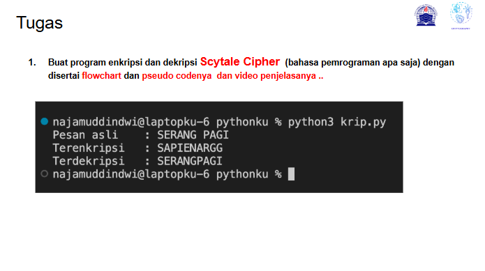
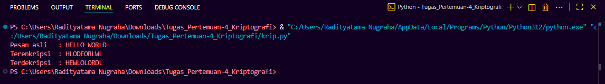
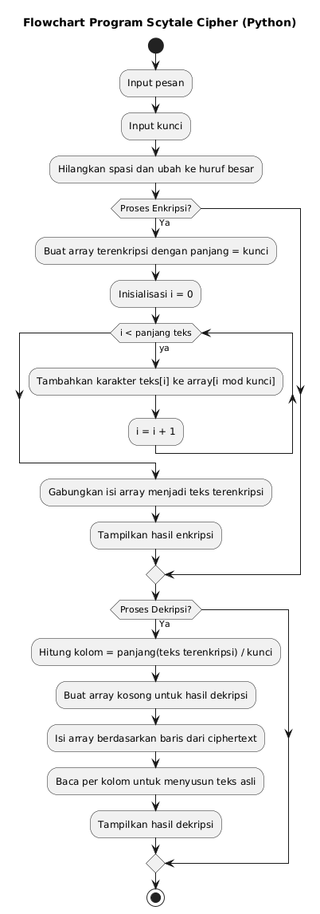

# Tugas Pertemuan 4 

|Nama|NIM|Kelas|Mata Kuliah|
|----|---|-----|------|
|**Radityatama Nugraha**|**312310644**|**TI.23.A3**|**Kriptografi**|

# Soal :



## Code Program :
```python
def scytale_encrypt(text, key):
    text = text.replace(" ", "").upper()
    encrypted = [''] * key
    for i in range(len(text)):
        encrypted[i % key] += text[i]
    return ''.join(encrypted)


def scytale_decrypt(ciphertext, key):
    ciphertext = ciphertext.replace(" ", "").upper()
    n = len(ciphertext)
    cols = n // key + (n % key != 0)
    decrypted = [''] * cols
    index = 0

    for i in range(key):
        for j in range(cols):
            if index < n:
                decrypted[j] += ciphertext[index]
                index += 1
    return ''.join(decrypted)


pesan = "HELLO WORLD"
kunci = 3

terenkripsi = scytale_encrypt(pesan, kunci)
terdekripsi = scytale_decrypt(terenkripsi, kunci)

print("Pesan asli   :", pesan)
print("Terenkripsi  :", terenkripsi)
print("Terdekripsi  :", terdekripsi)
```

## Output :



## Flowchart Scytale Cipher:



## Pseudocode :

```
ALGORITMA SCYTALE_CIPHER
INPUT teks, kunci
HAPUS spasi dari teks
UBAH ke huruf besar

BUAT array terenkripsi dengan panjang = kunci
UNTUK i dari 0 sampai panjang teks - 1
    TAMBAHKAN karakter teks[i] ke array[i mod kunci]
SELESAI
GABUNG semua elemen array jadi string terenkripsi

HITUNG kolom = panjang(teks terenkripsi) / kunci
BAGI teks terenkripsi ke baris-baris sesuai kunci
BACA karakter per kolom untuk menyusun teks asli

OUTPUT hasil enkripsi dan dekripsi
END
```
## Penjelasan Pseudocode Caesar Cipher

### - Program dimulai
```
START
```

### - Program meminta dua input dari pengguna:
#### - teks = kalimat yang ingin dienkripsi, misalnya "HELLO WORLD"
#### - kunci = jumlah baris atau lilitan pada tongkat, misalnya 3
```
INPUT teks, kunci
```

### - Program menghapus spasi dari teks agar hanya huruf yang diproses
```
HAPUS spasi dari teks
UBAH ke huruf besar
```

### - 🔒 Proses Enkripsi

### - Program menyiapkan array kosong sebanyak nilai kunci
```
BUAT array terenkripsi dengan panjang = kunci
```

### - Program melakukan perulangan dari huruf pertama hingga terakhir.
#### - Setiap huruf akan ditempatkan ke array sesuai rumus i mod kunci.
#### - Misalnya jika kunci = 3 dan teks = “HELLOWORLD”:
```
| Index (i) | Huruf | i mod 3 | Masuk ke array baris ke |
| --------- | ----- | ------- | ----------------------- |
| 0         | H     | 0       | 0                       |
| 1         | E     | 1       | 1                       |
| 2         | L     | 2       | 2                       |
| 3         | L     | 0       | 0                       |
| 4         | O     | 1       | 1                       |
| 5         | W     | 2       | 2                       |
| 6         | O     | 0       | 0                       |
| 7         | R     | 1       | 1                       |
| 8         | L     | 2       | 2                       |
| 9         | D     | 0       | 0                       |
```
```
UNTUK i dari 0 sampai panjang teks - 1
    TAMBAHKAN karakter teks[i] ke array[i mod kunci]
SELESAI
```

### - Setelah semua huruf ditempatkan, program menggabungkan isi dari semua baris menjadi satu string
```
GABUNG semua elemen array jadi string terenkripsi
```

### - 🔓 Proses Dekripsi
### - Program menghitung jumlah kolom dengan rumus:
```
HITUNG kolom = panjang(teks terenkripsi) / kunci
```

### - Program membagi teks terenkripsi ke dalam beberapa baris sesuai jumlah kunci
```
BAGI teks terenkripsi ke baris-baris sesuai kunci
```

### - Program membaca huruf per kolom dari tiap baris untuk menyusun kembali urutan asli teks
```
BACA karakter per kolom untuk menyusun teks asli
```

### - Program menampilkan hasil dari proses enkripsi dan dekripsi ke layar
```
OUTPUT hasil enkripsi dan dekripsi
```

### - Program selesai dijalankan
```
END
```

